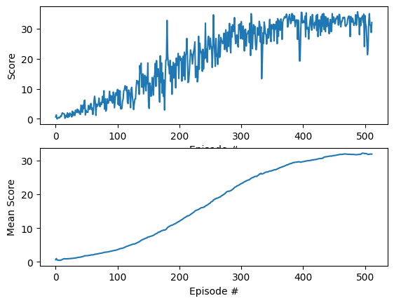

# Deep Deterministic Policy Gradient (DDPG) Report

## Learning Algorithm

The Deep Deterministic Policy Gradient (DDPG) algorithm was implemented to solve the Unity Reacher environment. DDPG is an actor-critic algorithm designed for environments with continuous action spaces. It uses two neural networks for both the actor (policy) and critic (action value function): local networks for learning and target networks for stable updates. The main steps in each episode are:

1. Receive the initial state from the environment.
2. Select an action using the actor network, adding Ornstein-Uhlenbeck noise for exploration.
3. Execute the action, observe the reward and next state.
4. Store the experience (state, action, reward, next_state, done) in a replay buffer.
5. Every `LEARN_EVERY` steps, sample a minibatch from the buffer (if there are enough experience tuples) and perform multiple learning updates:
	 - Update the critic by minimizing the mean squared error between predicted Q-values and target Q-values.
	 - Update the actor using the sampled policy gradient.
	 - Soft-update the target networks using the parameter $\tau$.

This implementation was adapted from the [Udacity DRL implementation](https://github.com/udacity/deep-reinforcement-learning).

## Model Architecture

Both the actor and critic networks are fully connected feedforward neural networks:

- **Actor Network:**
	- Input Layer: Size equal to the state space (33 for Reacher).
	- Hidden Layer 1: 256 units, ReLU activation.
	- Hidden Layer 2: 256 units, ReLU activation.
	- Output Layer: Size equal to the action space (4 for Reacher), with tanh activation to bound actions in [-1, 1].

- **Critic Network:**
	- Input Layer: State size (33).
	- Hidden Layer 1: 256 units, ReLU activation.
	- Hidden Layer 2: 256 units, ReLU activation (after concatenating action input).
	- Output Layer: 1 unit (Q-value).

## Hyperparameters

The following hyperparameters were used for training:

| Hyperparameter | Value         | Description                                  |
|---------------|---------------|----------------------------------------------|
| BUFFER_SIZE   | 100000        | Replay buffer size                           |
| BATCH_SIZE    | 256           | Minibatch size for learning                  |
| GAMMA         | 0.99          | Discount factor for future rewards           |
| TAU           | 1e-3          | Soft update parameter for target networks    |
| LR_ACTOR      | 3e-5          | Learning rate for actor optimizer            |
| LR_CRITIC     | 4e-4          | Learning rate for critic optimizer           |
| HIDDEN_SIZE_1 | 256           | First hidden layer size                      |
| HIDDEN_SIZE_2 | 256           | Second hidden layer size                     |
| WEIGHT_DECAY  | 0.0           | L2 weight decay for critic                   |
| LEARN_EVERY   | 40            | Steps between learning updates               |
| NUM_TRAINING  | 20            | Number of learning updates per step          |
| n_episodes    | 800           | Number of training episodes                  |
| t_max         | 900           | Max timesteps per episode                    |

Additionally, an Ornstein-Uhlenbeck process was used as a noise model with the default parameters from the DDPG Paper (Lillicrap et al. 2016), i.e. θ = 0.15 and σ = 0.2. 

## Results

The following plot shows the episode scores and mean scores over time. The agent gradually improves, reaching a plateau with a score higher than 30 as learning stabilizes. The trained model parameters are saved in `checkpoint_actor.pth` and `checkpoint_critic.pth`.

## Ideas for Future Work

Potential improvements include:
- Tuning hyperparameters for faster and more stable learning.
- Implementing alternative exploration strategies (e.g., parameter noise).
- Explore different noise models like Gaussian noise.
- Using prioritized experience replay.
